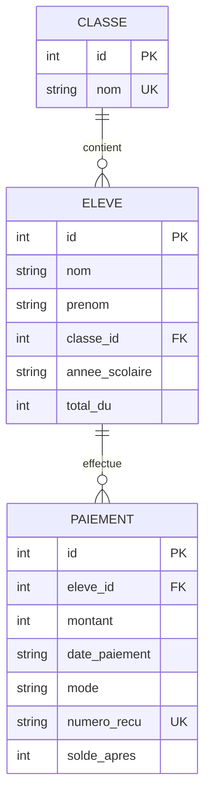

# Modélisation des données EduPaie

## MCD (Modèle Conceptuel de Données)

## MLD (Modèle Logique de Données)

### Table `classe`
| Colonne | Type | Contraintes | Description |
|---------|------|-------------|-------------|
| id | INTEGER | PRIMARY KEY, AUTOINCREMENT | Identifiant unique de la classe |
| nom | TEXT | UNIQUE, NOT NULL | Nom de la classe (ex: 6ème A) |

### Table `eleve`
| Colonne | Type | Contraintes | Description |
|---------|------|-------------|-------------|
| id | INTEGER | PRIMARY KEY, AUTOINCREMENT | Identifiant unique de l'élève |
| nom | TEXT | NOT NULL | Nom de l'élève |
| prenom | TEXT | NOT NULL | Prénom de l'élève |
| classe_id | INTEGER | NOT NULL, FOREIGN KEY(classe.id) ON DELETE RESTRICT | Classe de l'élève |
| annee_scolaire | TEXT | NOT NULL | Année scolaire (ex: 2024-2025) |
| total_du | INTEGER | NOT NULL | Montant total dû (FCFA) |

### Table `paiement`
| Colonne | Type | Contraintes | Description |
|---------|------|-------------|-------------|
| id | INTEGER | PRIMARY KEY, AUTOINCREMENT | Identifiant unique du paiement |
| eleve_id | INTEGER | NOT NULL, FOREIGN KEY(eleve.id) ON DELETE RESTRICT | Élève concerné |
| montant | INTEGER | NOT NULL | Montant payé (FCFA) |
| date_paiement | TEXT | NOT NULL | Date du paiement (ISO YYYY-MM-DD) |
| mode | TEXT | NOT NULL | Mode de paiement (especes, virement, cheque, mobile) |
| numero_recu | TEXT | UNIQUE, NOT NULL | Numéro de reçu (ex: REC-2024-000001) |
| solde_apres | INTEGER | NOT NULL | Solde restant après ce paiement |

## Choix de modélisation

### Pourquoi les entités CLASSE, ELEVE, PAIEMENT ?

- **CLASSE** : Les élèves sont regroupés par classe pour faciliter la gestion et le filtrage
- **ELEVE** : Entité centrale, représente un élève scolarisé
- **PAIEMENT** : Historique des paiements d'un élève, avec numérotation séquentielle par année

### Pourquoi les clés étrangères en RESTRICT ?

- **ON DELETE RESTRICT** : Empêche la suppression d'une classe ou d'un élève s'il y a des paiements associés
- **Intégrité des données** : Garantit que l'historique des paiements reste intact
- **Audit trail** : L'historique financier ne peut pas être modifié accidentellement

### Pourquoi `solde_apres` figé dans PAIEMENT ?

- **Historique immuable** : Chaque paiement enregistre l'état du solde APRÈS ce paiement
- **Reconstitution du solde** : Le solde actuel peut être recalculé en prenant le dernier paiement
- **Correction de paiement** : Si un paiement doit être corrigé, on insère un nouveau paiement plutôt que de modifier l'existant
- **Audit financier** : Permet de retracer l'évolution du solde au fil du temps

### Pourquoi `numero_recu` UNIQUE ?

- **Unicité** : Chaque reçu doit avoir un numéro unique pour éviter les doublons
- **Référence** : Le numéro de reçu sert de référence pour les imprimés et les demandes
- **Traçabilité** : Facilite la recherche d'un paiement spécifique

### Pourquoi `annee_scolaire` dans ELEVE ?

- **Contexte temporel** : Un élève peut changer de classe d'une année à l'autre
- **Historique** : Permet de conserver l'historique de scolarité
- **Requêtes** : Facilite les requêtes par année scolaire

### Pourquoi `total_du` dans ELEVE ?

- **Montant de référence** : Le total dû est fixe pour une année scolaire
- **Calcul de solde** : Solde = total_du - somme(paiements)
- **Facturation** : Peut varier selon les classes ou les années

### Pourquoi `mode` de paiement en TEXT ?

- **Flexibilité** : Permet d'ajouter de nouveaux modes sans modification du schéma
- **Évolutivité** : Modes possibles : especes, virement, cheque, mobile, carte, etc.
- **Simplicité** : Pas besoin de table de lookup pour les modes de paiement

### Pourquoi les montants en INTEGER (FCFA) ?

- **Précision monétaire** : Évite les erreurs d'arrondi des nombres flottants
- **FCFA non décimal** : Le franc CFA n'a pas de sous-unités
- **Calculs exacts** : Les calculs de solde sont exacts avec des entiers
